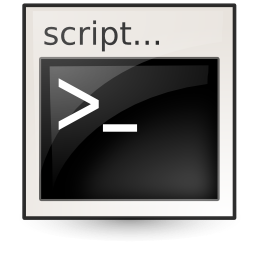
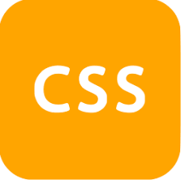
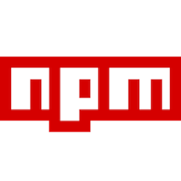

# Understand Qur'an
Helps understanding the Holy Qur'an

# Tech used

## Languages
1.  Javascript
1.  Typescript
1.  Shell script
1.  CSS
1.  SCSS
1.  YAML

## Frameworks and libraries
1.  ReactJS
1.  NextJS
    - Code splitting
    - Prefetching
    - Server-side rendering at runtime
    - Automatically rendered as static HTML
    - Automatically generated as static HTML + JSON
    - Incremental static regeneration
    - Client side rendering
1.  Docker
1.  Docker Compose
1.  Stylelint
1.  Eslint
1.  Storybook
1.  Material UI
1.  Webpack
1.  Verdaccio (private npm registry)
1.  NPM (for creating, publishing and reusing private packages)
1.  SWR (React Hooks library for data fetching)
1.  GraphQL
1.  Apollo server express
1.  Apollo client

## Conventions
1. SuiteCSS

# Requirements
1. Docker
1. Docker Compose

# Services
- understand-quran: front end
- design-library: a design library for the front end
- npm-registry: private npm registry

## Run all services
```bash
./start
```

## Stop all services
```bash
./stop
```

## Restart services
```bash
./restart <service name>
```

## URLs

- understand-quran: http://localhost:3000
- design-library: http://localhost:6006
- npm-registry: http://localhost:4873

## View logs
```bash
./logs <service name>
```

## Shell into services
### npm-registry
```bash
./shell-npm-registry
```
### other services
```bash
./shell <service name>
```

## Debug
### understand-quran
- Client side code: Use `debugger`
- Server side code: Add `debugger` to server side code. 
  - Chrome: Go to `chrome://inspect/ -> Under "Remote Targets" click on "inspect"`
  - VSCode:
    1. Add this task in `.vscode/tasks.json`:
        ```json
        {
          "version": "2.0.0",
          "tasks": [
            {
              "label": "clear-editor-history",
              "command": "${command:workbench.action.clearEditorHistory}"
            }
          ]
        }
        ```
    1. Add this debugger configuration in `.vscode/launch.json` and lauch after starting server:
        ```json
        {
          "version": "0.2.0",
          "configurations": [
            {
              "type": "node",
              "request": "attach",
              "name": "Launch Program",
              "skipFiles": ["<node_internals>/**"],
              "port": 9229,
              "preLaunchTask": "clear-editor-history"
            }
          ]
        }
        ```
